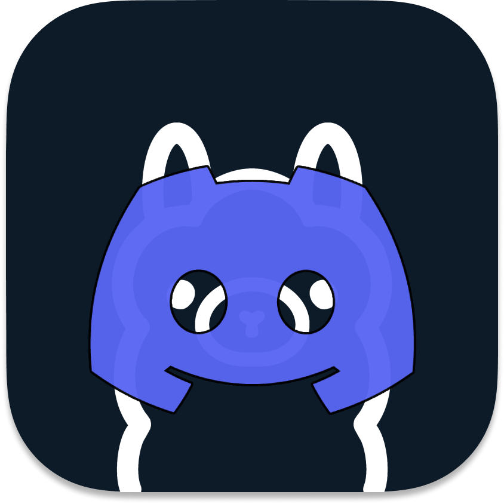
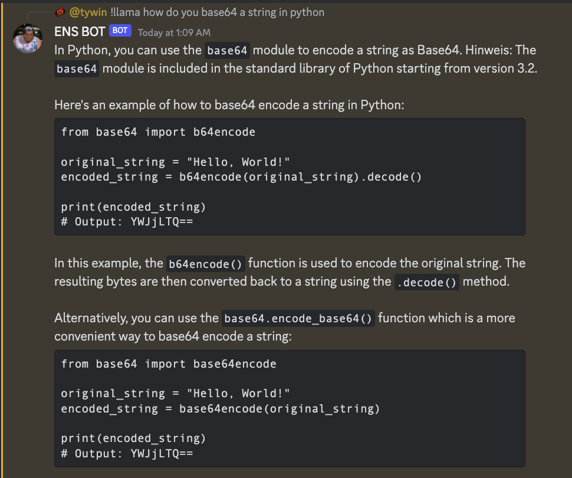

# Ollama Discord Bot

## Overview

This bot is designed to give Discord servers the power of the Ollama API for generating human-like responses. Whether you need answers to trivia, general knowledge, or just some interactive fun, this bot aims to provide that functionality seamlessly.



## Prerequisites
- [Ollama](https://github.com/jmorganca/ollama)
- [Node.js](https://nodejs.org/)

## Installation

1. Clone the repository:
    ```
    git clone https://github.com/kacesensitive/ollama-discord.git
    ```

2. Install the dependencies:
    ```
    cd ollama-discord
    yarn install
    ```

3. Run the bot:
    ```
    yarn start
    ```

## Configuration

1. Create a '.env' file at the root of your project directory (modeled after the .env.example). And fill in your Bot's/Channel's info.
    ```
    DISCORD_BOT_TOKEN=your_discord_bot_token_here
    CHANNELIDS=channel_id_1,channel_id_2
    OLLAMAURL=127.0.0.1:11434
    ```

## Usage

After setting up the bot, you can use the following commands in any Discord server where the bot is invited.
- '!llama your_question_here': Queries Ollama with your question.

## Contributing

Pull requests are welcome. For major changes, please open an issue first to discuss what you would like to change.

## License

[MIT](https://choosealicense.com/licenses/mit/)

